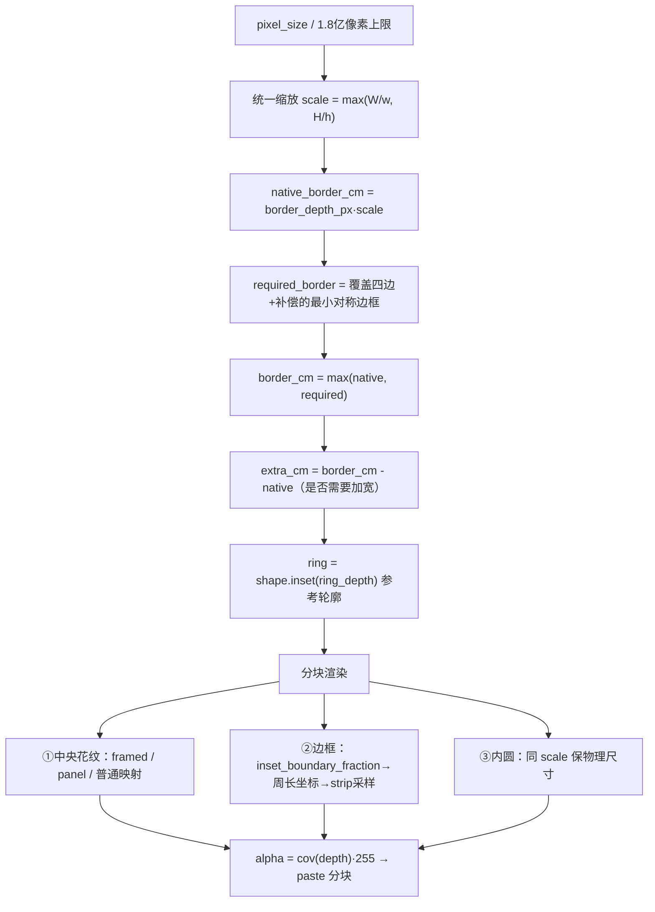
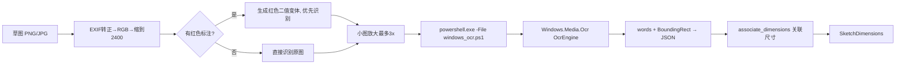

# CustomIrregularShape-System — 其余核心模块源码深读

> 配套文档：`项目分析报告.md`、`弧形台与图库监听源码解读.md`、`采样与布局识别源码解读.md`
> 源码基准：`master` 分支
> 覆盖：自动渲染边框映射 · 本地 OCR · 素材读取/缓存 · 导出 · 项目 IO · 后台线程

---

# Part 1 · 自动渲染 `core/source_renderer.py` — 边框连续映射

这是"自动模式"的渲染器，与手工模式的 `core/renderer.py` 并列，由 `design_service.generate` 按 `material.source_layout` 是否存在二选一。它把"识别出的整幅素材"无缝排到异形轮廓上。

## 1.1 主流程（`render_source`）



### ① 统一缩放，不拉伸边框
```python
scale = ContentMapping.source_scale(layout, design.diameter_cm, design.height_cm)  # max(W/w, H/h)
native_border_cm = layout.border_depth_px * scale
border_cm = max(native_border_cm,
                ContentMapping.required_border(layout, design.diameter_cm, design.height_cm))
```
- **一个等比缩放同时覆盖两个方向**（注释："do not stretch the frame to compensate for missing source height"）—— 素材高度不足时不会把边框和英文纵向拉长。
- `required_border` 取"盖住原四边内容边界 + 尺寸补偿公差"所需的最小**对称**边宽，保证四边统一。

### ② 加宽只能扩展纯色留白
```python
extra_cm = border_cm - native_border_cm
plain_band = uniform_strip_band(layout.strip) if extra_cm > 1e-9 else None
if extra_cm > 1e-9 and plain_band is None:
    raise ValueError('…没有足够的纯色留白；为避免装饰变形，请换用比例更接近…')
```
需要把边框加宽时，**只把 `extra_cm` 映射进原条带中的纯色带**（`plain_band`），装饰与细线保持原径向比例；没有可扩展留白就**明确报错**，绝不拉伸装饰。

### ③ 切向缩放锚定在花纹附近
```python
ornament = np.max(np.ptp(layout.strip, axis=1), axis=1)          # 每行的变化幅度
source_depth = np.average(np.arange(len(ornament)) + .5, weights=ornament)  # 花纹深度重心
ring_depth = source_depth * scale
if plain_band and source_depth >= plain_band[1]: ring_depth += extra_cm
ring = shape.inset(ring_depth) if border_cm else shape           # 作为相位参考轮廓
origin = (strip_width - ring.chord / scale) / 2
```
用"花纹行权重"求质心，把参考轮廓 `ring` 锚在**花纹实际所在的深度**，而不是扩展出来的空白边距里 —— 否则圆点/文字会被放在错误的切向比例上。

### ④ 边框像素的连续映射
```python
border_pixels = depth < border_cm + px_cm/2
rows, columns = np.nonzero(border_pixels)
border_depth = depth[rows, columns]
s = inset_boundary_fraction(shape, x[0,columns], y[rows,0],
                            np.clip(border_depth,0,border_cm), ring) * ring.perimeter
sample_depth = np.maximum(0, source_depth_cm / scale - .5)
if layout.strip_is_sentence: stripe = sample_sentence_strip(...)
else:                        stripe = sample_perimeter_strip(layout.strip, s, sample_depth, ring.perimeter, scale, origin)
blend(border_rgb, stripe, cov(border_cm - border_depth))
```
- `inset_boundary_fraction` 给出**连续顺时针周长坐标** `s`（见第 3 份文档 2.6）：它让**下半圈文字旋转 180° 而非镜像**，并只在直边/弧接头附近做 miter 修正。
- 只对 `border_pixels` 做周长几何与插值，内部像素保留原花纹，**避免给内部像素做无谓的周长计算**（性能 + 正确性）。
- `cov(border_cm - border_depth)` 在边框内缘做 1 像素抗锯齿混合。

### ⑤ 条纹四角补全 `_complete_corner_ticks`
```python
straight_count = floor(inner.chord / (period * scale))              # 直边整周期数
arc_count      = floor(2 * ring.radius * inner.angle / (period * scale))
u = where(on_line, x/scale + straight_count*period/2, theta*ring.radius/scale + arc_count*period/2)
valid = (u >= 0) & (u < limit)
ticks = sample(shifted, u, source_depth, wrap_x=True)               # shifted 让单元从真实背景起止
```
直边按**物理 x**、弧按**角度 θ** 各用一个变换，分别放下 `floor` 个**完整周期**，避免径向截断；`np.roll` 把重复单元起点移到原素材真实背景处（不切在白色描边中间），保留原色与抗锯齿。

### ⑥ 内圆与主画布
```python
inner_scale = scale                                   # 与外填充同物理尺寸
inner_band = inner_layout.border_depth_px * inner_scale
arc = ((arctan2(y,x)+pi/2) % (2pi)) * max(radius - inner_band/2, .001)
stripe = sample_perimeter_strip(inner_layout.strip, arc, max(0, inner_depth/inner_scale - .5), inner_perimeter, inner_scale)
blend(content, stripe, cov(inner_band - inner_depth))
blend(rgb, content, cov(inner_depth))
alpha = round(cov(depth) * 255)
```
内圆**复用同一 `scale`**，让内外花纹物理尺寸一致；用极角做周长映射。最后按 `cov(depth)` 生成 alpha 并**分块 paste**。

### ⑦ 独立画框映射 `framed_artwork_mapping.sample_framed_artwork`
```python
result = sample(artwork.tile, u, v, wrap_x=True, wrap_y=True)   # 背景纹理双向平铺
picture = layout.image[top:bottom, left:right]                  # 中央原画
distance = min(u+.5, right-left-.5-u, v+.5, bottom-top-.5-v) * mapping.scale_cm
blend(result, sample(picture, u, v), clip(distance/pixel_cm + .5, 0, 1))
```
背景用**验证过的原纹理 tile 双向 wrap**铺满；中央画框用统一映射采样，并用"到画框边缘的厘米距离"做抗锯齿叠加 —— 画框保持矩形、比例不变。

---

# Part 2 · 本地 OCR `services/sketch_recognition.py` + `windows_ocr.ps1`

## 2.1 全本地、不联网



**关键约束**：全程在**本机**完成 —— 图片不离开磁盘、不下载模型、不联网。非 Windows 平台直接报错并提示手工输入：
```python
if os.name != 'nt':
    raise ValueError('自动识别使用 Windows 系统 OCR；当前平台请手工输入草图尺寸。')
```

## 2.2 `recognize_sketch`：红色标注优先

```python
red = ((R>170) & (G<150) & (R-G>65) & (R-B>65))          # 红色标注检测
if np.count_nonzero(red) > 25:
    variants.append(黑白化(red))                          # 红→黑、其余→白，分离标注
variants.append(image)                                    # 再识别原图
...
variant.save(prepared)
result = subprocess.run(['powershell.exe','-NoProfile','-NonInteractive','-ExecutionPolicy','Bypass',
                         '-File', script, '-ImagePath', prepared],
                        capture_output=True, timeout=45, creationflags=CREATE_NO_WINDOW)
data = json.loads(result.stdout.decode('utf-8-sig'))
fallback = associate_dimensions(data['words'], data['width'], data['height'])
if fallback.width_cm is not None: return fallback          # 先出结果者胜
```
- 有红色标注时**先生成"红→黑"的二值图**分离识别，再识别原图（标注优先）；
- 小图放大最多 3×（≤1600px）帮助系统 OCR 认字；
- 子进程 `timeout=45`、`CREATE_NO_WINDOW`（无黑框）；失败给出末 500 字符 stderr。

## 2.3 `windows_ocr.ps1`：PowerShell 桥接 WinRT

```powershell
$null = [Windows.Media.Ocr.OcrEngine, Windows.Media.Ocr, ContentType=WindowsRuntime]
$bridge = [System.WindowsRuntimeSystemExtensions].GetMethods() | Where-Object { ... IAsyncOperation`1 ... }
function Await-Result($Operation, [Type]$ResultType) {
    $task = $bridge.MakeGenericMethod($ResultType).Invoke($null, @($Operation)); $task.Wait(); return $task.Result
}
$engine = [Windows.Media.Ocr.OcrEngine]::TryCreateFromLanguage([Windows.Globalization.Language]::new('en-US'))
if ($null -eq $engine) { $engine = [Windows.Media.Ocr.OcrEngine]::TryCreateFromUserProfileLanguages() }
$words = @($result.Lines | ForEach-Object { $_.Words } | ForEach-Object { @{text=$_.Text; x=$_.BoundingRect.X; ...} })
ConvertTo-Json -InputObject @{words=$words; width=...; height=...} -Depth 4 -Compress
```
- 用 `AsTask` 反射桥接 WinRT 异步 → PowerShell 同步等待（`Await-Result`）；
- 语言**优先 en-US，回退用户语言**（README 所述 "优先英语，回退用户语言"）；
- 输出每个词的 `text + BoundingRect(x,y,w,h)` + 位图宽高，紧凑 JSON。

## 2.4 `associate_dimensions`：保守的尺寸关联（不猜）

```python
# 1) 归一化：，/, → .
# 2) 合并被 OCR 拆开的数字：同行(y 差 < .45·字高) 且 水平相邻(gap < .65·字高)
#    decimal：若两段之间有小点 mark(宽高 < .4·字高, 位于中下部) → 补 "."
# 3) 候选 = (数值, x/w, y/h)，过滤标题(y 在 .12~.90 外)
candidates = [c for c in candidates if .12 < c[2] < .90]
if len(candidates) == 3:      # 左侧居中者为直边，上下者为宽/高
    left = min(candidates, key=lambda c: c[1])
    others = sorted([...], key=lambda c: c[2])
    if left[1] < .25 and others[0][2] < left[2] < others[1][2]:
        w, h, straight = others[0][0], left[0], others[1][0]
        if 0 < h <= w and 0 < straight < w: return SketchDimensions(w, h, straight, ...)
if len(candidates) == 2:      # 只给长边/总高候选，直边不猜
    h, w = sorted(c[0] for c in candidates); widest = max(...)
    if widest[2] < .70: return SketchDimensions(w, h, None, '…弧形台仍需填写直边…')
return SketchDimensions(None, None, None, '无法可靠关联尺寸…请参照草图手工填写。')
```
设计哲学：**宁可返回 None 让用户手填，也不猜**。两处尺寸时明确不给弧形台直边；无法关联时列出候选值供人核对。这一保守策略与 README "只有两处尺寸时给出长边/总高候选，不猜测弧形台直边"完全一致。

---

# Part 3 · 素材读取与缓存 `services/materials.py`

## 3.1 `load_image`：三级省内存
```python
with Image.open(Path(path)) as source:
    if max_side:
        scale = min(1, max_side / max(source.size))
        source.draft('RGB', tuple(max(1, round(v*scale)) for v in source.size))   # ① JPEG 解码器层缩小
    ImageOps.exif_transpose(source, in_place=True)                                 # ② EXIF 原地转正
    if max_side: source.thumbnail((max_side, max_side), LANCZOS)
    return source if source.mode == 'RGB' else source.convert('RGB')              # ③ 已是 RGB 不再拷贝
```
- **JPEG `draft`** 让解码器**直接输出小图**，在分配全分辨率缓冲之前就省内存；
- EXIF **原地**转正（`in_place=True`）；
- 已是 RGB 就**不再 `convert`**，省一次全图拷贝。

## 3.2 `prepare`：按文件身份失效的字节级 LRU 缓存

```python
identity = (material, str(path), mtime_ns, ctime_ns, size, inode)   # 文件被改/替换自动失效
# 小源图：preview 直接复用 full 分析（避免大 print 源被迫降到预览）
# 缓存：OrderedDict + RLock，按字节(256MiB) 与 条目数(8) 双限 LRU
while _prepared and (_cache_bytes + size > _MAX_CACHE_BYTES or len(_prepared) >= 8):
    _, (_, removed) = _prepared.popitem(last=False); _cache_bytes -= removed
```
要点：
- **失效键**含 mtime/ctime/size/inode → 素材被编辑或替换后自动重读；
- 数组 `setflags(write=False)` **只读**防污染；
- 计大小按**底层数组 owner 去重**（视图共享 `base` 不重复计）：
  ```python
  root = array
  while isinstance(root.base, np.ndarray): root = root.base
  if id(root) not in owners: size += root.nbytes; owners.add(id(root))
  ```
- **并发保护**：另一 worker 可能已准备同一文件（`if key in _prepared: return ...`）；
- 小自动源让 preview/full **共享同一 key**，不双份记账。

`_prepare` 分两条路：`layout=='source'` → `analyze_layout`；否则按 `content_box`/`strip_box` 裁切。

---

# Part 4 · 导出 `services/export.py` — 原子替换

```python
handle, temporary = tempfile.mkstemp(prefix='.shape-', suffix=suffix, dir=path.parent)
os.close(handle)
try:
    if suffix == '.png':
        image.save(temporary, format='PNG', compress_level=1, dpi=(dpi, dpi))   # 快速无损
    else:
        flat = Image.new('RGB', image.size, 'white')
        flat.paste(image, mask=image.getchannel('A'))                            # alpha 合成到白底
        flat.save(temporary, format='JPEG', quality=95, subsampling=0, dpi=(dpi, dpi))
    os.replace(temporary, path)                                                  # 原子替换
finally:
    if os.path.exists(temporary): os.unlink(temporary)
```
- **原子替换**：先写同目录临时文件，成功后 `os.replace` —— 编码中途失败**不会损坏已有成品**；`finally` 清理残留临时文件。
- PNG：`compress_level=1` 快速无损（像素/透明度不变，文件可能稍大）；
- JPG：先按 alpha 合成**白底**，`quality=95, subsampling=0`（不做色度降采样）；
- 两者都写入 **DPI 元数据**。

---

# Part 5 · 项目 IO `services/project_io.py` — 版本化 JSON

```python
path.write_text(json.dumps({'schema_version': 1, 'design': payload}, ensure_ascii=False, indent=2), ...)
# 保存时：素材路径转相对项目文件的相对路径（跨盘符 ValueError 则跳过）
payload[key]['path'] = os.path.relpath(payload[key]['path'], path.parent)
```
```python
if raw.get('schema_version') != 1: raise ValueError('不支持的项目文件版本')
# 读取时：重建 CropBox / MaterialSpec / BorderSpec / DesignSpec，路径解析为相对项目文件
item['path'] = str((path.parent / item['path']).resolve())
...
design = DesignSpec(**data); design.validate()
```
要点：
- **带 `schema_version`**，未来新增字段应有默认值、迁移单独实现（避免静默丢字段）；
- 路径 **相对化** → 项目可整体搬迁（跨盘符时保留绝对路径）；
- 读取即 `validate()`，非法项目立刻报错。

> 兼容性：`test_arc.py::test_arc_project_round_trip_and_old_project_defaults` 验证 —— 删除 `shape_mode`/`straight_cm` 字段的**旧 JSON 仍能读取**（默认回退为 `circular`）。

---

# Part 6 · 后台线程 `workers/`

三个 `QThread` 适配器，**都不导入 gui**，把 `isInterruptionRequested` 作为取消回调传入服务层：

```python
class RenderWorker(QThread):
    progress = pyqtSignal(int); status = pyqtSignal(str); result = pyqtSignal(object)
    error = pyqtSignal(str);    cancelled = pyqtSignal()
    def run(self):
        try:
            image = generate(self.design, self.preview, self.output,
                             self.progress.emit, self.isInterruptionRequested, status=self.status.emit)
            self.result.emit(image if self.preview else None)
        except RenderCancelled: self.cancelled.emit()
        except Exception as error: self.error.emit(str(error))
```

| Worker | 职责 | 额外 |
|---|---|---|
| `RenderWorker` | 已有 design 直接渲染 | 只在预览时回传图像 |
| `WorkflowWorker` | 解析→匹配→生成 | 回传 `match_info` 与分阶段 `timings`（match / generate） |
| `SketchWorker` | 后台本地 OCR | 取消后抛 `RenderCancelled` |

`WorkflowWorker` 用 `perf_counter` 记录 **匹配** 与 **生成** 两段耗时（对应 UI 状态栏 "用时" 的口径说明）：生成内部再把 prepare/render/save 分别计时。

**取消语义**（与 ARCHITECTURE.md 一致）：分块之间响应取消；图片加载与文件编码阶段需等当前操作结束；未完成编码不替换已有文件。

---

# Part 7 · 阶段进度与耗时口径

`design_service.generate` 是编排核心：

```python
prepare → render(preview/full) → save
render_progress = (lambda v: progress(round(v*.90))) if progress and output else progress
...
if progress: progress(94)          # 编码保存
save_image(result, output, effective_dpi)
if progress: progress(100)         # 成功写入
```
- 进度：**渲染 0–90 → 编码保存 94 → 成功 100**，编码没写完就不会到 100；
- `timings` 记录 `prepare / render / save` 三段（UI 悬停可见）；
- 预览与导出**读同一份分析**（缓存），但导出独立读原分辨率；`effective_dpi` 在预览时按比例反算。

---

# Part 8 · 小结

| 模块 | 核心难点 | 关键手法 |
|---|---|---|
| `source_renderer` | 边框沿异形轮廓无缝、不拉伸、不镜像 | 统一等比 scale、纯色带吸收加宽、ring 锚定花纹、连续顺时针周长坐标、四角整周期 |
| `sketch_recognition` | OCR 数字被拆分/小数点、位置关联 | 红色标注分离优先、数字邻接合并、小数点检测、三/两处尺寸保守关联、不猜 |
| `materials` | 大图内存 + 跨单复用 | JPEG draft、文件身份失效、字节级 LRU、只读数组、owner 去重计数 |
| `export` | 不损坏已有成品 | mkstemp + `os.replace` 原子替换、PNG 快速无损、JPG 白底合成 |
| `project_io` | 可搬迁 + 前向兼容 | schema_version、相对路径、旧字段默认回退 |
| `workers` | 不阻塞 UI、可取消 | QThread + 信号、`isInterruptionRequested` 回调、分阶段 timings |

贯穿主题：**服务层管 I/O 与编排、核心层管纯计算**；对不可靠输入（OCR、素材结构、并发缓存）一律**保守降级而非猜测**；所有写盘走**原子替换**；所有性能优化保留**逐像素一致性**。

---

*本解读基于仓库 `master` 分支源码逐行整理，代码片段均引自实际源文件。*
