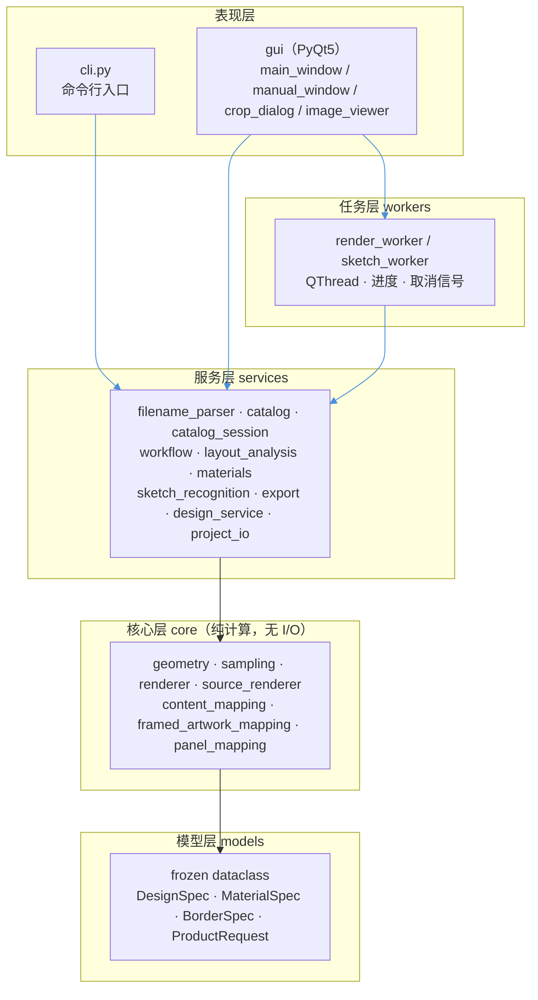
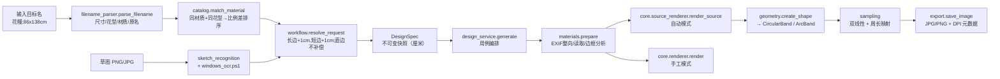
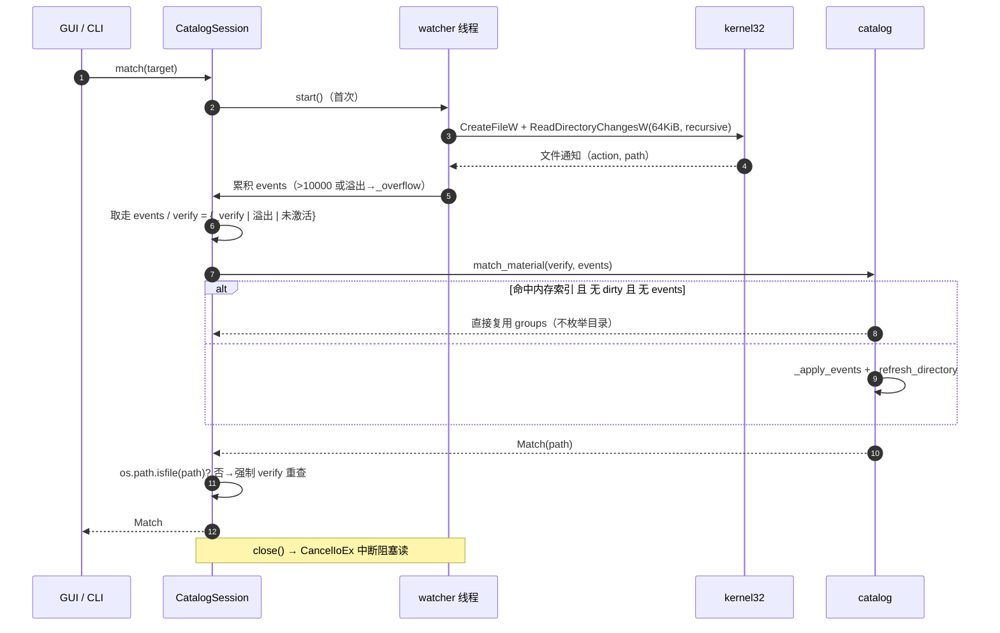

# CustomIrregularShape-System — 架构图 & 源码深读

> 配套文档：`CustomIrregularShape-System-项目分析报告.md`
> 源码基准：`master` 分支

---

# Part 1 · 架构图（Mermaid）

## 1.1 分层依赖（严格单向）



**约束**：`models`/`core` 不导入 Qt 或文件操作；`workers` 不导入 GUI；界面**不实现裁剪数学**。

## 1.2 端到端数据流



## 1.3 图库监听（catalog_session）与匹配时序



`_apply_events` 的 action 编码（Windows 原生）：
`1=ADDED 2=REMOVED 3=MODIFIED 4=RENAMED_OLD 5=RENAMED_NEW`

---

# Part 2 · 弧形台 ArcBand 几何算法深读

文件：`shape_crop/core/geometry.py`

## 2.1 模型定义

弧形台是**上下对称的短圆弧模型**：中间是上下两条水平直边（长度 `chord = L`），左右各接一段向外鼓出的圆弧，整体左右对称。

```
设计参数：diameter=W（包围宽/最大宽度）  height=H（总高）  chord=L（直边）
```

### 构造校验（`__post_init__`）
```python
if not all(isfinite(...)): raise ...
if not 0 < height <= diameter or not 0 < chord < diameter: raise ...
if diameter - chord > height: raise  # 侧弧鼓出过大
```
即必须满足 `0 < H ≤ W`、`0 < L < W`、`W − L ≤ H`。

### 派生量
| 属性 | 公式 | 含义 |
|---|---|---|
| `half_height` | `H/2` | 半高（直边到中轴） |
| `sagitta` | `(W−L)/2` | 侧的弓高（鼓出量） |
| `radius` | `((H/2)² + s²)/(2s)` | 侧圆弧半径（由弦高 H、弓高 s 反推） |
| `center` | `W/2 − R` | 右侧圆心 x 坐标（左圆心取负） |
| `angle` | `asin(min(1, (H/2)/R))` | 圆弧半角（圆心角的一半） |
| `perimeter` | `2L + 4Rθ = 2L + 2·arc_length` | 总周长 |

半径公式推导：圆弧弦长 = H、弓高 = s，由 `R = c²/(8s) + s/2` 得 `R = (H²/(4) + s²)/(2s)`。

## 2.2 等距内缩 `inset(d)` —— 边框平行性的关键

```python
def inset(self, distance):
    radius, half_h = self.radius - distance, self.half_height - distance
    chord = 2 * (self.center + sqrt(max(0, radius**2 - half_h**2)))
    return ArcBand(self.diameter - 2*distance, 2*half_h, chord)
```

要点：
- **圆心保持不变**，半径与半高各减 `d`；
- 直边长度 `chord` 由「内缩后的圆弧与 `y=±(H/2−d)` 相交」**重新求解**，而不是简单平移 —— 否则接头处会错位；
- `test_arc_parallel_insets_and_arc_length_joints` 逐个验证：内缩轮廓上任意点 `depth()` 恰等于 `d`，且四个接头（上/下直边端点、弧与直边交点）的弧长坐标精确。

## 2.3 有符号距离场 `depth(x, y)`

```python
def _arc_projection(self, x, y):
    ax = abs(x)
    theta = clip(arctan2(y, ax - self.center), -angle, angle)   # 限定在有限圆弧角度内
    px = self.center + radius*cos(theta); py = radius*sin(theta)
    return theta, hypot(ax - px, y - py)

def depth(self, x, y):
    _, distance = self._arc_projection(x, y)
    limit = self.center + sqrt(max(0, R**2 - min(|y|, half_h)**2))
    signed = where(|x| <= limit, distance, -distance)          # 弧内为正，弧外为负
    return min(half_height - |y|, signed)
```

- 用 `|x|` 把左右投影到同一个右弧，天然保证**左右对称**；
- **投影到有限圆弧**（角度被 `clip` 到 `[-θ, θ]`），而非支撑整圆 —— 这正是 ARCHITECTURE.md 强调的"不能使用支撑圆未参与轮廓的部分"；
- 返回 `min(直边距离, 弧距离)`：内部为正、外部为负，供渲染做透明度/边框判定。

## 2.4 周长参数化 `boundary_coordinate(x, y)`

把轮廓边界按**弧长**参数化，从左上接头起、**顺时针** 走一圈，共四段：

```
下直边  top    = line_x + L/2                      其中 line_x = clip(x, -L/2, L/2)
右弧    right  = L + R·(θ_p + α)                    θ_p = clip(arctan2(y, |x|-center), -α, α)
上直边  bottom = L + arc + L/2 - line_x
左弧    left   = 2L + arc + R·(α - θ_p)
返回  (coordinate / perimeter) % 1
```

这就是**边框/花纹沿周长映射的坐标系**。因为使用真实弧长与真实物理坐标，圆点不会被扭成椭圆、文字不会变成斜体。

## 2.5 圆弧→圆的退化（正确性锚点）

`test_arc_reduces_to_circle_and_remains_symmetric`：
当 `ArcBand(W, H, chord=CircularBand(W,H).chord)` 时，`center==0`、`perimeter` 相等、`depth` 与 `CircularBand` **逐点一致**，且关于原点中心对称。

这说明 **ArcBand 是 CircularBand 的严格推广**：`H=W` 时退化为完整圆，`H<W` 时退化为截圆，`L<chord` 时成为弧形台。

## 2.6 `inset_boundary_fraction` —— 接头防截断（细节最深处）

```python
def inset_boundary_fraction(shape, x, y, depth, reference=None):
    center = shape.center if isinstance(shape, ArcBand) else 0
    radius, half_h = shape.radius - depth, shape.half_height - depth
    angle = arcsin(clip(half_h/radius, 0, 1))
    chord = 2*(center + sqrt(max(0, radius**2 - half_h**2)))
    ...
    # 直边用物理 x（所有径向行共享），不按各行 chord 归一化
    # 否则会把圆剪切、把直立的字母变成斜体
    transition = max(min(2*(shape.radius - reference.radius), reference.radius*.02), 1e-6)
    weight = clip(1 - (angle - |clipped_theta|)*reference.radius/transition, 0, 1)
    correction = ((chord - ref_chord)/2 + reference.radius*(angle - reference.angle)) * weight
    right -= sign(clipped_theta) * correction
    left  += sign(clipped_theta) * correction
```

关键思想（ARCHITECTURE.md 的"各径向位置使用自身内缩轮廓的直边/圆弧接头"）：
1. 边框是**有厚度的带**，若整条带都投影到同一个固定轮廓，接头附近的字母会被**重复/截断**；
2. 所以**每个径向行用它自己那层内缩轮廓的接头位置**；
3. 但完全按各行归一化又会**相位漂移**（圆弧被剪切、圆点变斜椭圆）；
4. 折中：用 `reference`（锚在花纹附近的 ring 轮廓）作为基准，只在一个很窄的 **miter 过渡区** `transition` 内做修正，且修正量按 `weight` 平滑衰减到 0；
5. 结果：接头处对齐、远离接头处相位稳定 —— **字母不被截断，也不变形**。

## 2.7 工厂与测试

```python
def create_shape(design):
    if design.shape_mode == 'arc':  return ArcBand(design.diameter_cm, design.height_cm, design.straight_cm)
    if design.shape_mode != 'circular': raise ValueError('未知轮廓模块')
    return CircularBand(design.diameter_cm, design.height_cm)
```

`tests/test_arc.py` 覆盖：尺寸补偿只作用于宽高（直边不变）、平行内缩与弧长接头、圆退化与对称、非法参数、JSON 往返与旧项目默认回退、两种渲染器均遵守弧形遮罩、非对称花纹+完整边框保持。

---

# Part 3 · 图库监听与匹配深读

文件：`services/catalog.py`（纯逻辑索引/核对） + `services/catalog_session.py`（Windows 递归监听）

## 3.1 问题背景

真实场景是 **221,905 张、持续增长的 SMB 共享图库**。实测：每次全量核对目录约 17–23 秒；换订单时反复枚举网络目录不可接受。

## 3.2 catalog.py：分层索引 + 增量核对（跨平台回退路径）

### 索引结构
```python
_indexes = OrderedDict()      # LRU：最多保留 4 个图库
_index_lock = RLock()
# CatalogIndex = {groups, stamps, records, children}
#   groups   {pattern.casefold(): [(path, parsed)]}
#   stamps   {dir: frozenset(条目名)}     ← 是否为"最新"的判据
#   records  {dir: {name: parsed}}
#   children {dir: set(子目录路径)}
```

### 两个关键教训

**① 不用目录时间戳判脏，比较条目名集合**
```python
def _directory_stamp(path):
    with os.scandir(path) as entries:
        return frozenset(e.name for e in entries)
```
原因（注释原文）：NTFS 会**延迟更新目录时间戳**，快速删/改名会漏检；比较条目名集合更可靠，且无需重新解析。

**② 只下钻新增子目录**
```python
def _refresh_directory(index, path, cancelled):
    ...
    records = {n: p for n,p in old.items() if n in files}   # 保留仍存在的
    for name in files - previous:                            # 只解析新增
        records[name] = _parse_entry(name)
    for removed in old_children - children: _refresh_directory(...)  # 处理删除的子树
    for added  in children - old_children: _refresh_directory(...)   # 只扫新增的子树
```

### 事件应用（不枚举网络目录）
```python
def _apply_events(index, events, cancelled):
    for action, path in events:
        if action in (2,4):   # 删除 / 改名旧名 → 移除子树或删除单条
        elif action in (1,5): # 新增 / 改名新名 → 新增目录则 _refresh_directory，否则解析单文件
```
采用**写时复制**（`dict(index.records[parent])` 后改副本），避免污染缓存中的旧索引。

### 缓存命中判定
```python
def _catalog(...):
    cached = _indexes.get(key)
    if cached:
        dirty = set(changes)
        if verify:                       # 只在需要"核对"时逐个目录比对 stamp
            for p, stamp in cached.stamps.items():
                if _directory_stamp(p) != stamp: dirty.add(p)
        if not dirty and not events:      # 干净且有监听事件喂入 → 直接复用
            return cached.groups
        updated = ...; _apply_events(updated, events); _refresh_directory(...)
```
即：**正常换单时不会遍历目录**；只有 verify、事件溢出、或监听失效时才核对。

### 候选筛选与排序
```python
MAX_RATIO_ERROR = log(1.05)          # 5% 比例容差

ratio_error = |log(parsed.ratio / target.ratio)|
size_error  = |log(parsed.w/target.w)| + |log(parsed.h/target.h)|

def rank(item):
    if ratio <= MAX_RATIO_ERROR: return (0, size, ratio, path)   # 先"比例达标"组
    return (1, ratio, size, path)                               # 兜底组
```
规则：① 先限定**同花型**（`pattern.casefold()`）；② 再限定**同材质**（`target.material` 非空时）；③ 优先选**比例差 ≤5%** 的，其中按尺寸差排；④ 无达标者用**比例差**最小的兜底，并在 UI 提示"花纹裁剪可能增加"。全程**用对数比**（`log` 让宽高对称、尺度无关）。

## 3.3 catalog_session.py：Windows ReadDirectoryChangesW 递归监听

无 Qt 依赖，独立 daemon 线程，纯 `ctypes` 调用 `kernel32`：

```python
kernel.CreateFileW(path, 1, 7, None, 3, 0x02000000, None)
#                      │  │     │        │  FILE_FLAG_BACKUP_SEMANTICS（可监控目录）
#                      │  │     │        OPEN_EXISTING
#                      │  │     share = 读写删全共享
#                      │  FILE_LIST_DIRECTORY
kernel.ReadDirectoryChangesW(handle, buffer, 65536, True, 1|2, &received, None, None)
#                             64KiB(SMB上限)      recursive ↑   ↑ FILE_NOTIFY_CHANGE_FILE_NAME|LAST_WRITE
```

**原生结构解析**（`FILE_NOTIFY_INFORMATION`）：
```python
step, action, size = struct.unpack_from('<III', raw, offset)
name = raw[offset+12 : offset+12+size].decode('utf-16-le')
path = normpath(join(directory, name))
```
`step==0` 表示本条链结束。

**健壮性设计**：
- **溢出降级**：`received.value` 为空（缓冲区溢出）或事件累计 >10000 → `_overflow=True` 并清空 → 下次强制 `verify`（回退全量核对）；
- **异常回滚**：`match()` 中把已取走的 events 在异常时**放回**队列，不丢事件；
- **死文件防护**：匹配结果先 `os.path.isfile` 再交付，删除或漏通知时强制 `verify=True` 重查，**绝不交出已删除文件**；
- **优雅关闭**：`close()` 调 `CancelIoEx` 中断阻塞中的 `ReadDirectoryChangesW`，线程随后 `CloseHandle`；
- **非 Windows 自动回退**：`os.name != 'nt'` 不启动线程 → `active=False` → 每次 `verify=True`（等价 catalog.py 的目录核对模式）。

## 3.4 与其他模块的接缝

- `workflow.resolve_request` 里：有 `catalog_session` 就走会话匹配，否则 `match_material` 直连目录核对：
```python
match = (catalog_session.match(target, cancelled, status) if catalog_session
         else match_material(target, request.library_dir, cancelled, status))
```
- 结果 `Match(path, source, ratio_error)` 同时驱动 UI 的匹配来源提示（比例差百分比、素材偏小告警、兜底告警）。

---

# Part 4 · 小结（这两块的工程价值）

| 维度 | 弧形台几何 | 图库监听 |
|---|---|---|
| 核心难点 | 异形边框的**平行内缩**与**周长映射相位** | 22万张网络图库的**换单延迟** |
| 关键手法 | 半径/半高各减 d + 重解直边；有限弧投影；miter 过渡区加权修正 | ReadDirectoryChangesW 增量 + 条目名戳脏 + 事件溢出降级 |
| 质量保障 | 与圆退化逐像素一致、接头处 depth 精确 | 死文件再验证、异常事件回滚、只读索引 |
| 实测收益 | 保证文字不镜像/不变形（定性） | 第二花型匹配 17.42s → 0.011s（定量） |

两者共同的工程哲学：**把"几何/系统"层做到纯函数 & 可测试，把"物理细节"（真实弧长、原生事件）留在最贴近问题的地方，绝不在界面层复制计算。**

---

*本解读基于仓库 `master` 分支源码逐行整理，所有公式与代码片段均引自实际源文件。*
