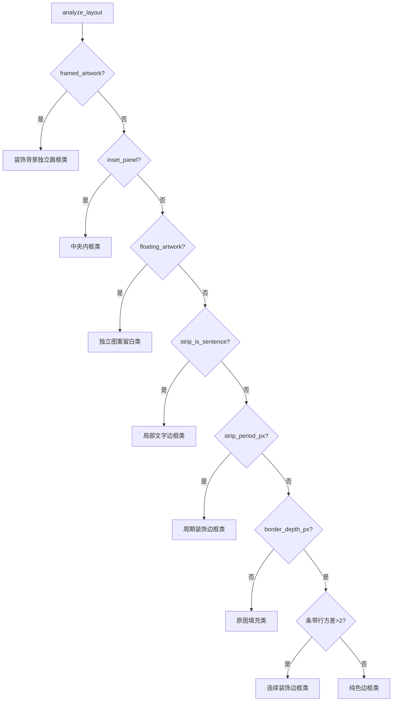
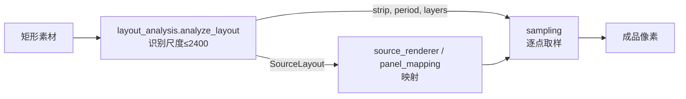

# CustomIrregularShape-System — 采样插值 & 边框布局识别 源码深读

> 配套文档：`项目分析报告.md`、`弧形台与图库监听源码解读.md`
> 源码基准：`master` 分支

---

# Part 1 · 采样与双线性插值（`core/sampling.py`）

## 1.1 职责与坐标约定

整个渲染管线的像素取值都走这一个模块。**坐标约定**（模块 docstring 明示）：

> 坐标是**源像素中心** —— 像素索引 `i` 的中心位于坐标 `i`；函数接受 float 坐标，返回 `uint8`。

所有"几何量 → 像素量"的换算（`x/scale + (w-1)/2` 之类）都遵循这个约定，因此 `+0.5`/`−0.5` 的偏移在调用处出现，而不是在采样核内。

对外暴露 4 类入口 + 1 个辅助：

| 函数 | 用途 |
|---|---|
| `sample` | 通用向量化双线性采样（核心） |
| `content_sample` | 中央花纹：满铺 cover / 物理平铺 tile |
| `strip_sample` / `sample_perimeter_strip` | 边框带沿周长映射（整数周期闭合） |
| `sample_sentence_strip` | 非周期句子/英文，按原锚点贴边 |
| `uniform_strip_band` | 找最长纯色带，用于"加宽边框" |

## 1.2 核心 `sample()`：向量化双线性

```python
def sample(image, x, y, wrap_x=False, wrap_y=False):
    height, width = image.shape[:2]
    x = np.asarray(x, dtype=np.float32); y = np.asarray(y, dtype=np.float32)
    x = x % width if wrap_x else np.clip(x, 0, width - 1)
    y = y % height if wrap_y else np.clip(y, 0, height - 1)
    x0, y0 = np.floor(x).astype(np.int32), np.floor(y).astype(np.int32)
    x1 = (x0 + 1) % width if wrap_x else np.minimum(x0 + 1, width - 1)
    y1 = (y0 + 1) % height if wrap_y else np.minimum(y0 + 1, height - 1)
    fx, fy = (x - x0.astype(np.float32))[..., None], (y - y0.astype(np.float32))[..., None]
    ...
```

设计要点：

1. **两种边界策略**：`clip`（夹取，用于 cover —— 超出部分取边缘像素）与 `wrap`（取模，用于平铺/边框 —— 首尾无缝）。`x1/y1` 也同步按策略处理，保证右/下边界正确。
2. **float32 的刻意维护**：注释点破一个 NumPy 陷阱 ——
   > *"Subtracting int32 indices promotes float32 coordinates to float64 in NumPy."*
   即 `x - x0`（int32）会把 float32 隐式提升成 float64。所以代码显式写 `x0.astype(np.float32)`，把插值全程锁在 float32，**临时内存带宽减半**。
3. **先横后纵**：`a = img[y0,x0]*(1-fx) + img[y0,x1]*fx`（上两邻点横向插值），`b` 同理；再 `a*(1-fy)+b*fy`。
4. **就地复用缓冲**（省内存的关键）：
   ```python
   np.multiply(a, 1 - fy, out=a)
   np.multiply(b, fy, out=b)
   np.add(a, b, out=a)
   np.clip(a, 0, 255, out=a)
   return a.astype(np.uint8)
   ```
   三个全尺寸 float RGB 数组被压缩成**一次分配 + 就地运算**，避免大图渲染时的峰值内存。

## 1.3 性能核心：网格放大时复用源行

当坐标是**广播笛卡尔网格**（`x` 仅 1 行、`y` 仅 1 列）且是**放大**时，很多输出行会落到**同样的两行源像素**上：

```python
if x.ndim == y.ndim == 2 and x.shape[0] == 1 and y.shape[1] == 1:
    rows, inverse = np.unique(np.concatenate((y0[:, 0], y1[:, 0])), return_inverse=True)
    if len(rows) < 2 * y.shape[0]:          # 输出行数 > 源行数 ⇒ 放大
        horizontal = (image[rows[:, None], x0].astype(np.float32) * (1 - fx)
                      + image[rows[:, None], x1] * fx)          # 唯一源行各做一次横向插值
        a = horizontal[inverse[:y.shape[0]]]
        b = horizontal[inverse[y.shape[0]:]]
    else:                                    # 否则回退原路径
        ...
```

- `np.unique` 去重得到**唯一源行集合**，横向插值只对唯一行做一次，再用 `inverse` 索引还原 —— 把"每个输出像素读 4 个邻点"降为"每唯一源行读 2 个邻点"。
- 判据 `len(rows) < 2*y.shape[0]`：只有确实发生行复用（放大）时才走这条路径，否则回落通用公式。
- **保持原运算顺序**：注释强调 "Preserve the original operation order for identical uint8 results" —— 因为 uint8 舍入对运算顺序敏感，复用路径必须与逐像素结果**逐比特一致**，这正是 `docs/PERFORMANCE.md` 中"渲染 25.25s→18.80s（−26%）且逐像素一致"的来源。

> 验证：`tests/test_sampling.py::test_upscaled_grid_reuses_source_rows...` 用 `CountedImage.__getitem__` 计数 gather 次数，断言 `sum(gathered) < 128*200`，直接证明"没有为每个输出像素重复读 4 邻点"。

## 1.4 三类映射入口

**① `content_sample`（中央花纹）**
```python
if material.fit == 'tile':
    tile_h = material.tile_width_cm * h / w
    return sample(image, (x + width_cm/2)*w/material.tile_width_cm - .5,
                  (y + height_cm/2)*h/tile_h - .5, True, True)   # 双向 wrap，物理尺寸平铺
scale = max(width_cm / w, height_cm / h)                          # cover：统一等比，取较大比例
return sample(image, x/scale + (w-1)/2, y/scale + (h-1)/2)        # 中心对齐，双向 clip
```
`tile` 用**物理厘米**驱动平铺（同一花型在不同区域位移整周期后结果一致，见测试）；`cover` 用 `max` 保证两个方向都覆盖、不全拉伸。

**② `strip_sample` / `sample_perimeter_strip`（周期边框）**
```python
repeats = max(1, round(perimeter / repeat_cm))          # 用"整数个完整周期"闭合周长
u = arc_length / perimeter * repeats * w - .5           # 周向 wrap
v = depth / band_width * h - .5                         # 径向 clip
return sample(image, u, v, wrap_x=True)
```
`round(...)` 让**任意厘米周长**都用整数个周期闭合，消除轮廓起点处的相位跳变；周向 `wrap_x=True` 保证首尾接缝无缝。测试 `test_automatic_strip_length_and_closed_repeat` 断言 `arc=0` 与 `arc=perimeter` 结果相同。

**③ `sample_sentence_strip`（非周期句子）**
把条带按"各边段长"累积定位：`position % 总长` → `searchsorted` 找所属边 → 每段英文按**自己的原锚点**（`anchor`）贴到该边，用 alpha 通道混合。**不做周长重复**，因此局部短句保留原对角位置而非四边居中。`_sentence_layer` 中还有一条守卫：**满幅英文（笔画横向跨度 ≥ 80% 条带宽）不当作句子**，交给连续周长映射，避免把两侧笔画切断。

**④ `uniform_strip_band`**：`ptp(strip,axis=1)≤8` 且相邻行颜色差 ≤8，找最长连续纯色行带 —— 供"边框需要加宽时只扩展纯色留白"（装饰与细线不拉伸）。

## 1.5 与渲染层的配合

`core/renderer.py` 与 `core/source_renderer.py` 都用 `coverage()` 做 **1 像素抗锯齿**：
```python
def coverage(depth):  return np.clip(depth / px_cm + .5, 0, 1)
```
`depth` 是几何有符号距离场（厘米），`px_cm` 是一个像素的厘米尺寸 —— 于是边缘恰好跨约 1 像素做线性过渡。`blend()` 用 coverage 把纹理混到背景上。分块渲染 `block_rows=128`，块间检查 `cancelled`。

**测试覆盖**：像素中心与 wrap 边界；整数周期闭合无缝；tile 物理尺度一致；网格采样与独立四邻点公式逐像素一致（覆盖反向坐标、重复行、clamp、wrap 缝）；放大复用源行。

---

# Part 2 · 边框自动布局识别（`services/layout_analysis.py`）

## 2.1 总览：从一张矩形素材到 `SourceLayout`

输入 `PIL.Image`，输出一个 `frozen dataclass`：

```python
@dataclass(frozen=True)
class SourceLayout:
    image, strip, border_depth_px, width_px, height_px, report,
    content, content_box_px,
    strip_period_px=0, strip_is_sentence=False, sentence_layers=(),
    floating_artwork=None, inset_panel=None, corner_gaps=None, framed_artwork=None
```

`category` 属性把结构**分类**（README 反复强调"按图像结构分类，不按花型名称"）：



## 2.2 预处理与"双尺度"原则

```python
if image.height > image.width:  image = image.transpose(ROTATE_90)   # 竖图先横置
probe = image.copy() if max(width,height) > 2400 else image
if probe is not image:  probe.thumbnail((2400,2400), LANCZOS)        # 识别尺度封顶 2400
```

**识别尺度与采样尺度分离**（ARCHITECTURE.md 的关键约束）：
- 在高分辨率下，细花纹笔画会留下大量"个别平坦行"，把边界转变点**延迟上千像素**；
- 所以**识别**在最长边 2400px 的缩图上做，**取像素**仍用原分辨率 —— 既稳又快。
- `edge()` 正是这个原则的实现：先在缩图找 boundary，再回原分辨率**细化**：

```python
def edge(full, small):
    found = boundary_depth(small)
    if not found: return 0
    ratio = full.shape[0] / small.shape[0]; estimate = round(found * ratio)
    if ratio == 1: return estimate
    # 细化到"平坦→花纹"的转变点，而非最强色跳（后者可能是细黑线的起点，会把整条线排除）
    radius = max(2, ceil(2*ratio))
    ... 在 [estimate-radius, estimate+radius] 内找最近的 uniform→non-uniform 转变 ...
    return min(transitions, key=lambda v: abs(v - estimate)) if transitions else estimate
```

四边独立：`depth`（上）、`height - edge(翻转)`（下）、`edge(转置)`（左）、`width - edge(镜像转置)`（右）。

## 2.3 `boundary_depth()`：单边扫描的判据

只评估**中段**（25%–75% 列）以**避开矩形圆角**；扫描上界 `limit = 40%` 高度（有界）：

```python
uniform = mean(max|rows - median| <= 10, axis=1) >= .93      # 一行"平坦"的判据
run = max(5, round(height * .009))
for row in range(1, limit - run):
    if uniform[row-1] and not uniform[row] and not any(uniform[row:row+run]):
        ... # 候选转变点，再做多重守卫
```

核心逻辑：找**第一个持续的内容转变**（后面连续 `run` 行都不是平坦行）—— 而不是每个空白跳变，避免扫描**穿过**插画内部把画面裁掉。但有三类"看似内容、实为边框"的例外，逐一放行：

1. **短周期装饰**（`straight_ticks`）：
   ```python
   straight_ticks = (band_depth <= height*.09 and period and period <= band_depth
                     and mean(std(band, axis=0)) < 5)   # 径向恒定、周向周期 ⇒ 刻度/条纹
   if period and (band_depth <= 4*run or straight_ticks) and period <= max(4*run, 2*band_depth): continue
   ```
   并要求装饰带是**浅带 + 紧凑重复**（`band_depth <= 4*run` 或 straight_ticks），防止把整块满铺花砖误认为边框。
2. **非周期句子**：`not period and enclosed and mean(matches) >= .45 and min(mean(matches,axis=1)) >= .25` —— 稀疏墨迹、被同背景的平坦行包围，则仍是边框层。
3. **`_touching_ornament_end`**：处理"深色圆点紧贴中央花纹、没有内侧纯色分隔线"的情形，用短且完整的连续深色行 + 至少 8 次周期确认。

最后 `_blank_content_start()` 处理"封闭细框后的长空白 moat"：回搜空白区，要求是**有界的分隔线且两侧回到同一背景**才把它算作内容起点（否则水平花纹线会被误当作周长条带）。找不到可靠边界则返回 0（→ 降级原图填充）。

## 2.4 周期提取（`texture_period.extract_period`）

边框/装饰带的"整周期"由这个函数给出，是"周长无缝"的前提：

```python
variation = std(strip, axis=1).mean(axis=1)
rows = flatnonzero(variation > max(2., variation.max()*.25))   # 只用有变化的行，忽略平坦背景
signature = strip[rows].mean(axis=(0,2))                        # 每列一个标量签名
signal = (signature - mean)                                     # 去均值
fft = rfft(signal); correlation = irfft(fft*fft.conj())[:n]     # 自相关
correlation /= arange(n,0,-1) * variance                        # 归一化
for lag in range(2, n//3):
    if correlation[lag] < .90 or not 局部峰: continue
    ... 在候选 lag 附近用 MSE 精化 period ...
    if full_error <= max(3., variance*.12):                     # 全行验证
        return 中间的一个整周期, period
return strip.copy(), 0                                          # 无法可靠提取 → 用完整安全条带
```

- **FFT 自相关**找候选周期（≥0.90 且局部峰），再用**逐像素 MSE** 精化到整数像素；
- **全行验证**（不只签名均值）—— 注释指出"平均签名会掩盖交替 motif"；
- 取**正中间**的一个周期（`(width-period)//2`），便于相位对称；
- 无法提取周期时**明确降级**为完整条带（可能接缝），而非硬编造。
- `extract_dark_period` 是"背景含花纹时"的变体：先把深色像素（`max<40`）二值化成掩码，再用同一套自相关。

## 2.5 四类结构识别（各自的核心判据）

### ① 独立图案留白类 `detect_floating_artwork`
- 前景 = 与中位背景差 > 24；**连通域分析** `_components`（扫描线 + 并查集），分辨率 800。
- 大框（>80%宽 & >70%高）→ frame；中等连通域（面积 ≥ `max(12, w*h*0.0002)`）→ artwork。
- 要求 artwork 四侧到 frame 都有 **moat ≥ max(3, min(w,h)*5%)**，且四条留白条带前景占比 ≤10%（`stroke_end` 只剔除实测的**细连续框线**，厚色带仍判否）。
- 关键：要求**四侧真实留白**都等于内容背景 —— 把"对比文字/边框带"与"真空"区分开。

### ② 装饰背景独立画框类 `detect_framed_artwork`
- 深色连通域（`max<60`），尺寸限定在 40%–88%宽、30%–80%高；
- 四边深色线**完整**（每边 `max(edge) ≥ .94`）；
- **四周必须是同一周期纹理**：用 `_repeat()` 自相关验证上/下（横向周期 px）与左/右（纵向周期 py），MSE ≤ 4；
- 侧向扫描可能穿过宽菱格，所以用**同一验证过的顶部纹理**回定位真实背景 span；
- **refine 到原分辨率**取 tile 与中央画面（识别有界、像素原生）；
- 只在**唯一候选**时返回（`len==1`），否则宁可不判定。

### ③ 中央内框类 `detect_inset_panel`（两种）
- **半透明面板**：中段深线（`max<90`）占比 >95%，上下各一条细线、左右各一条竖线；内部有**褪色纹理**（`opacity = median(faded/background) ∈ (0.65,0.98)`），外部有真实深色花纹。
- **浅色面板**：浅色闭合线（`10 < diff < 100` 且 `min>110`）+ **安静中心**（`mean(inner<10) ≥ .90`）+ **有纹理的周围**（`mean(outer>15) ≥ .08`）。
- 两者返回 `InsetPanel(box, artwork?)`，供 `panel_mapping.adapt_panel` 按轮廓适配。

### ④ 句子层 `_sentence_layer`
抽取稀疏原墨迹与其**周向锚点**：只保留有变化的行、按每行自身背景抠出 ink、`mean(ink) ≤ .45` 才算稀疏、**横向跨度 ≥ 80% 宽度则弃用**（满幅英文交给连续映射）；返回 `roll(layer, offset)` 与 `anchor`。四边各抽一层，按顺时针组成 `sentence_layers`。

## 2.6 条带提取与合并

```python
region = _straight_outline_rows(pixels[:depth, safe_left:safe_right])   # 清理矩形圆角碎片
strip, period = extract_period(region) or extract_dark_period(region)
if not period:                                              # 非周期 → 尝试句子
    top_layer = _sentence_layer(region)
    if top_layer: sentence=True; layers=(四边层...); strip=纯平坦中位色
content = pixels[top:bottom, left:right]                    # 只取安全内容区
gaps = _stripe_corner_gaps(pixels, strip, period)           # 保留周期条纹四角原始纯色块
```

`_straight_outline_rows` 专门**剔除矩形圆角端部混入条带的斜向碎片**（保留抗锯齿行、补全平行细线之间的中段留白），避免圆角残留在圆桌/弧形台侧弧上产生"局部起伏"。

## 2.7 否决与降级（健壮性的灵魂）

- **floating 否决**：
  ```python
  if floating is not None and depth:
      _, frame_period = extract_period(frame_region)
      if (frame_period and frame_period >= 4) or _sentence_layer(frame_region) is not None:
          floating = None      # 有真周期装饰边框 / 句子层 ⇒ 不是 gallery
  ```
  防止把"普通满铺花纹外的周期装饰边框"误判成画廊留白而整体缩小。
- **无法判定就降级**：`boundary_depth` 返回 0 → `report` 明说"未检测到稳定边框分隔线，保留原图填充；可用高级选区"，**不虚构固定线条**。
- **越界报错**：`right<=left or bottom<=top` → `ValueError('原素材内容区识别失败…')`。

## 2.8 测试

`tests/test_layout_regression.py`、`test_floating_artwork.py`、`test_framed_artwork.py`、`test_inset_panel.py`、`test_pale_panel_striped_frame.py`、`test_sparse_text_frame.py`、`test_continuous_text_frame.py`、`test_touching_dot_border.py`、`test_pale_panel_striped_frame.py` 等覆盖：白底画廊、装饰画框、半透明/浅色内框、稀疏/连续文字、贴边圆点、浅宽条纹、圆角残留等真实结构。

---

# Part 3 · 两模块的协作与设计哲学



| 维度 | sampling.py | layout_analysis.py |
|---|---|---|
| 本质 | **数值**：坐标→像素的双线性核 | **视觉结构**：几何分带与分类 |
| 核心难点 | 放大时的行复用 + float32 精度 + 整数周期闭合 | 把"内容"与"边框/留白/装饰"可靠分开 |
| 关键手法 | 就地缓冲、`unique` 复用源行、wrap/clip 双策略、FFT+MSE 周期 | 双尺度（2400 识别/原生取样）、多重否决守卫、降级不虚构 |
| 质量保障 | 与逐像素公式逐比特一致 | 按结构分类而非名称；无法判定即报错/降级 |
| 共同点 | **纯函数、可单测、I/O 与计算分离**；不依赖 GUI/花型名 | 同左 |

两模块共同体现项目的工程哲学：
1. **计算与 I/O 严格分离**（`core` 纯计算，`services` 管像素与文件）；
2. **结构识别、非名称识别**（每种花型走同一套视觉判据）；
3. **正确性优先于覆盖率**：无法可靠判定时宁可降级并明确提示，也绝不编造线条或拉伸花纹；
4. **性能用实测背书**：采样优化的 −26% 与"逐像素一致"同时成立。

---

*本解读基于仓库 `master` 分支源码逐行整理，代码片段均引自实际源文件。*
